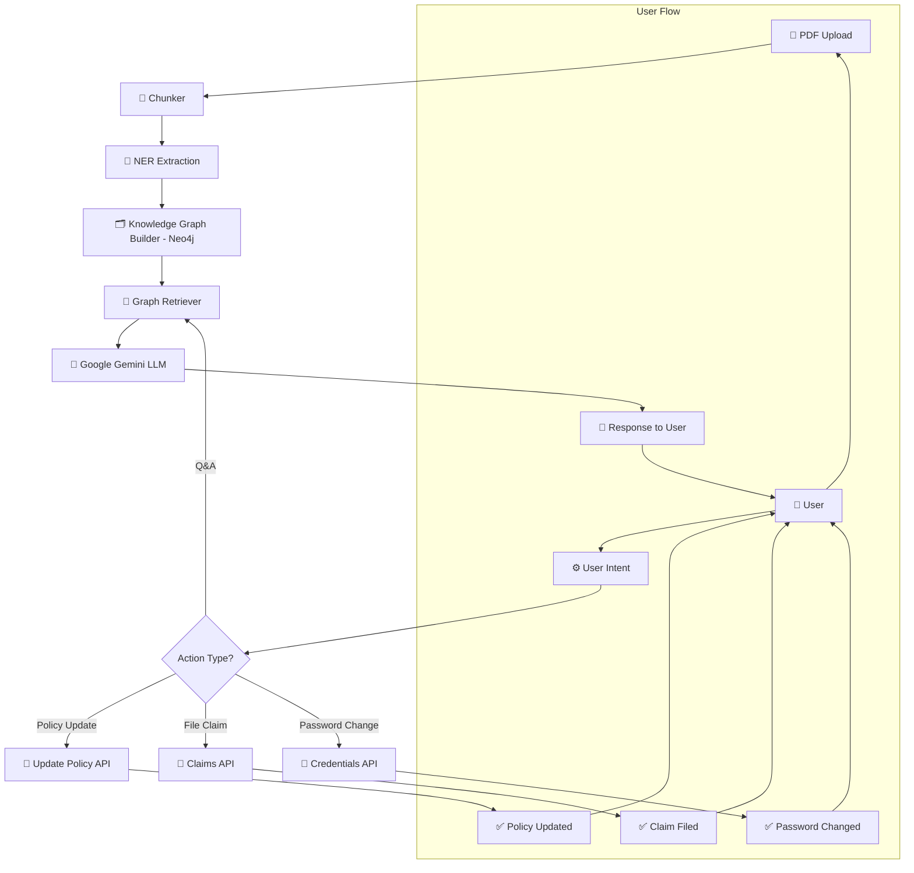

# 📌 Knowledge Graph RAG (Retrieval-Augmented Generation)

A **document Q&A system** that uses **Neo4j knowledge graphs** for intelligent retrieval and **LLM-based response generation**.  
The system supports **document management, insurance policy workflows using LangGraph, and real-time chat**.

---

## ✨ Features

### 📄 Document Processing
- PDF upload and intelligent chunking  
- Named Entity Recognition (NER) with **spaCy**  
- Keyword extraction and filtering  
- Automatic **Neo4j knowledge graph construction**  

### 🔍 Intelligent Retrieval
- Graph-based document retrieval  
- Context-aware answers via **Google Gemini LLM**  
- Configurable **retrieval depth & relevance scoring**  

### 👤 User Management
- User registration & authentication  
- Secure credential storage  
- Session management  

### 🏦 Insurance Features
- Insurance credential management  
- Policy updates & claims filing  
- Secure password change  

### 💬 Chat Interface
- Real-time messaging  
- Document upload during chat  
- Chat history & **thread-based conversations**  

---

## 🛠 Tech Stack

**Backend**
- FastAPI web framework
- Neo4j graph database
- SQLite for user/thread data
- spaCy for NER
- Google Gemini for LLM
- LangGraph for workflow
- PDFPlumber for document parsing 

**Frontend**
- React + React Router  
- TailwindCSS  
- React Toastify  

---

## ⚡ Prerequisites

- **Python** 3.10+  
- **Node.js** 18+  
- **Neo4j** 5.x (Local or [AuraDB](https://neo4j.com/cloud/aura/))  

---

## ⚙️ Environment Variables

Create a `.env` file in the project root:

```env
# Neo4j
NEO4J_URI=bolt://localhost:7687
NEO4J_USER=neo4j
NEO4J_PASSWORD=your_password

# LLM
GEMINI_API_KEY=your_gemini_key

# Database
DATABASE_URL=sqlite:///./app.db
```

---
##  🚀 Setup

### 1. Install Dependencies
```bash
#Backend
pip install -r requirements.txt

#Frontend
cd frontend
npm install
```

### 2. Initialize databases
```bash
python -m backend.database
python -m backend.mock_insurance_db
```

### 3. Start Servers
```bash
# Backend
uvicorn backend.API:app --reload --port 8000

# Frontend
cd frontend
npm run dev
```

### 4. Project Structure
```bash
├── backend/
|   |__config.py 
│   ├── API.py                # FastAPI routes
│   ├── chunker2.py           # PDF processing
│   ├── database.py           # Main DB operations
│   ├── gemini_client.py      # LLM integration
│   ├── graph_builder2.py     # Neo4j graph construction
│   ├── graph_pipeline.py     # Core pipeline
│   ├── graph_retriever2.py   # Graph-based retrieval
│   ├── ner_extractor.py      # Entity extraction
│   └── mock_*.py              # Mock services
├── frontend/
│   └── src/
│       ├── Pages/            # React components
│       └── Router/           # Route configuration               # Configuration settings
└── main.py                   # Entry point
```

### 5. Architecture Overview


## 🤝 Contributing

- Fork the repository
- Create a feature branch (git checkout -b feature/your-feature)
- Commit your changes (git commit -m "Add feature")
- Push to your branch (git push origin feature/your-feature)
- Open a Pull Request

## ⚖️ License & Disclaimer
⚠️ Disclaimer: This project is for research and demonstration purposes only.
It does not provide legal or financial insurance advice.


